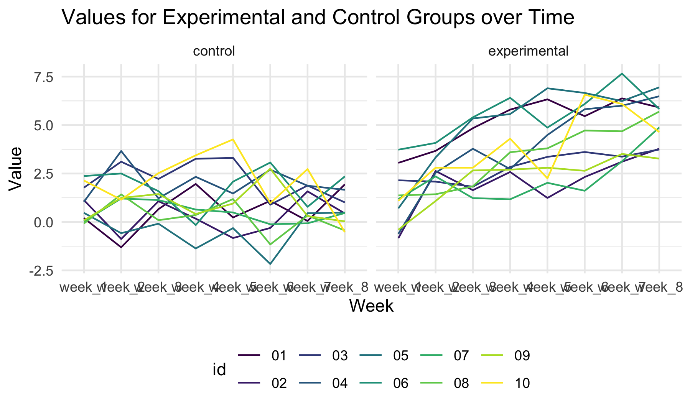

```{r setup, include=FALSE}
library(tidyverse)
library(rvest)
knitr::opts_chunk$set(
  fig.width = 6,
  fig.asp = .6,
  out.width = "90%"
)
theme_set(theme_minimal() + theme(legend.position = "bottom"))
options(
  ggplot2.continuous.colour = "viridis",
  ggplot2.continuous.fill = "viridis"
)
scale_colour_discrete = scale_colour_viridis_d
scale_fill_discrete = scale_fill_viridis_d
```

### Problem 2

## Dataframe with All File Names

```{r}
long_study_data = as_tibble(list.files("./data"))
```

## Iterating over File Names

```{r}
long_study_output =
  map(.x = long_study_data, ~ read_csv(.x))

nest_long_study_data = long_study_output %>% 
  data.frame %>% 
  mutate(
    long_study_data
  ) %>% 
  rename(
    week_1 = value.week_1,
    week_2 = value.week_2,
    week_3 = value.week_3,
    week_4 = value.week_4,
    week_5 = value.week_5,
    week_6 = value.week_6,
    week_7 = value.week_7,
    week_8 = value.week_8
  ) %>% 
  nest(data = week_1:week_8)
```

## Tidying Data

```{r}
tidied_nest_data = nest_long_study_data %>% 
  separate(
    col = value,
    into = c("group", "id"),
    sep = "_"
  ) %>% 
  mutate(
  group = recode(
    group,
    "con" = "control",
    "exp" = "experimental"
  ),
   id = substr(id, start = 1, stop = 2)
  )
```

## Spaghetti Plot

```{r}
spaghetti_plot = tidied_nest_data %>% 
  unnest(data) %>% 
  pivot_longer(week_1:week_8, names_to = "week", values_to = "value") %>% 
  ggplot(aes(x = week, y = value, group = id, color = id)) +
  geom_line() +
  facet_grid(. ~ group) +
  labs(
    title = "Values for Experimental and Control Groups over Time",
    x = "Week",
    y = "Value"
  )

ggsave("spaghetti_plot.png")

```

### Problem 3


