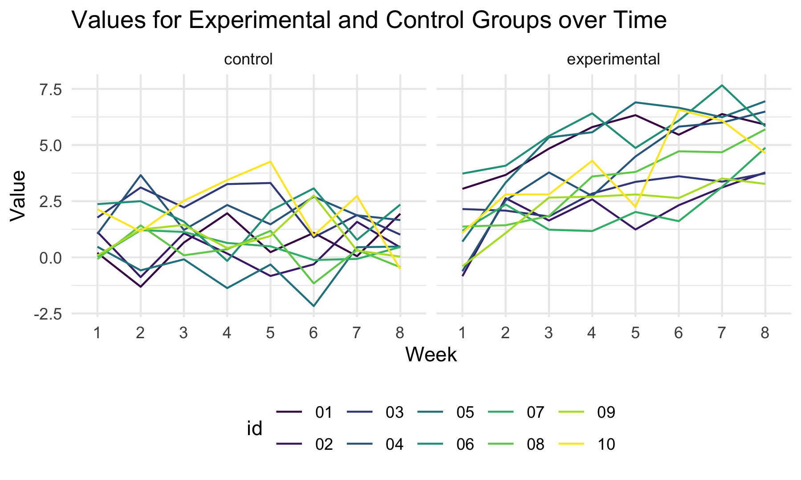

p8105\_hw5\_mjn2142
================
Matthew Neky
11/18/2021

### Problem 2

## Dataframe with All File Names

``` r
long_study_data = as_tibble(list.files("./data"))
```

## Iterating over File Names

``` r
long_study_output =
  map(.x = long_study_data, ~ read_csv(.x))

nest_long_study_data = long_study_output %>% 
  data.frame %>% 
  mutate(
    long_study_data
  ) %>% 
  rename(
    week_1 = value.week_1,
    week_2 = value.week_2,
    week_3 = value.week_3,
    week_4 = value.week_4,
    week_5 = value.week_5,
    week_6 = value.week_6,
    week_7 = value.week_7,
    week_8 = value.week_8
  ) %>% 
  nest(data = week_1:week_8)

knitr::kable(nest_long_study_data)
```

| value       | data                                                |
|:------------|:----------------------------------------------------|
| con\_01.csv | 0.20, -1.31, 0.66, 1.96, 0.23, 1.09, 0.05, 1.94     |
| con\_02.csv | 1.13, -0.88, 1.07, 0.17, -0.83, -0.31, 1.58, 0.44   |
| con\_03.csv | 1.77, 3.11, 2.22, 3.26, 3.31, 0.89, 1.88, 1.01      |
| con\_04.csv | 1.04, 3.66, 1.22, 2.33, 1.47, 2.70, 1.87, 1.66      |
| con\_05.csv | 0.47, -0.58, -0.09, -1.37, -0.32, -2.17, 0.45, 0.48 |
| con\_06.csv | 2.37, 2.50, 1.59, -0.16, 2.08, 3.07, 0.78, 2.35     |
| con\_07.csv | 0.03, 1.21, 1.13, 0.64, 0.49, -0.12, -0.07, 0.46    |
| con\_08.csv | -0.08, 1.42, 0.09, 0.36, 1.18, -1.16, 0.33, -0.44   |
| con\_09.csv | 0.08, 1.24, 1.44, 0.41, 0.95, 2.75, 0.30, 0.03      |
| con\_10.csv | 2.14, 1.15, 2.52, 3.44, 4.26, 0.97, 2.73, -0.53     |
| exp\_01.csv | 3.05, 3.67, 4.84, 5.80, 6.33, 5.46, 6.38, 5.91      |
| exp\_02.csv | -0.84, 2.63, 1.64, 2.58, 1.24, 2.32, 3.11, 3.78     |
| exp\_03.csv | 2.15, 2.08, 1.82, 2.84, 3.36, 3.61, 3.37, 3.74      |
| exp\_04.csv | -0.62, 2.54, 3.78, 2.73, 4.49, 5.82, 6.00, 6.49     |
| exp\_05.csv | 0.70, 3.33, 5.34, 5.57, 6.90, 6.66, 6.24, 6.95      |
| exp\_06.csv | 3.73, 4.08, 5.40, 6.41, 4.87, 6.09, 7.66, 5.83      |
| exp\_07.csv | 1.18, 2.35, 1.23, 1.17, 2.02, 1.61, 3.13, 4.88      |
| exp\_08.csv | 1.37, 1.43, 1.84, 3.60, 3.80, 4.72, 4.68, 5.70      |
| exp\_09.csv | -0.40, 1.08, 2.66, 2.70, 2.80, 2.64, 3.51, 3.27     |
| exp\_10.csv | 1.09, 2.80, 2.80, 4.30, 2.25, 6.57, 6.09, 4.64      |

## Tidying Data

``` r
tidied_nest_data = nest_long_study_data %>% 
  separate(
    col = value,
    into = c("group", "id"),
    sep = "_"
  ) %>% 
  mutate(
  group = recode(
    group,
    "con" = "control",
    "exp" = "experimental"
  ),
   id = substr(id, start = 1, stop = 2)
  )

knitr::kable(tidied_nest_data)
```

| group        | id  | data                                                |
|:-------------|:----|:----------------------------------------------------|
| control      | 01  | 0.20, -1.31, 0.66, 1.96, 0.23, 1.09, 0.05, 1.94     |
| control      | 02  | 1.13, -0.88, 1.07, 0.17, -0.83, -0.31, 1.58, 0.44   |
| control      | 03  | 1.77, 3.11, 2.22, 3.26, 3.31, 0.89, 1.88, 1.01      |
| control      | 04  | 1.04, 3.66, 1.22, 2.33, 1.47, 2.70, 1.87, 1.66      |
| control      | 05  | 0.47, -0.58, -0.09, -1.37, -0.32, -2.17, 0.45, 0.48 |
| control      | 06  | 2.37, 2.50, 1.59, -0.16, 2.08, 3.07, 0.78, 2.35     |
| control      | 07  | 0.03, 1.21, 1.13, 0.64, 0.49, -0.12, -0.07, 0.46    |
| control      | 08  | -0.08, 1.42, 0.09, 0.36, 1.18, -1.16, 0.33, -0.44   |
| control      | 09  | 0.08, 1.24, 1.44, 0.41, 0.95, 2.75, 0.30, 0.03      |
| control      | 10  | 2.14, 1.15, 2.52, 3.44, 4.26, 0.97, 2.73, -0.53     |
| experimental | 01  | 3.05, 3.67, 4.84, 5.80, 6.33, 5.46, 6.38, 5.91      |
| experimental | 02  | -0.84, 2.63, 1.64, 2.58, 1.24, 2.32, 3.11, 3.78     |
| experimental | 03  | 2.15, 2.08, 1.82, 2.84, 3.36, 3.61, 3.37, 3.74      |
| experimental | 04  | -0.62, 2.54, 3.78, 2.73, 4.49, 5.82, 6.00, 6.49     |
| experimental | 05  | 0.70, 3.33, 5.34, 5.57, 6.90, 6.66, 6.24, 6.95      |
| experimental | 06  | 3.73, 4.08, 5.40, 6.41, 4.87, 6.09, 7.66, 5.83      |
| experimental | 07  | 1.18, 2.35, 1.23, 1.17, 2.02, 1.61, 3.13, 4.88      |
| experimental | 08  | 1.37, 1.43, 1.84, 3.60, 3.80, 4.72, 4.68, 5.70      |
| experimental | 09  | -0.40, 1.08, 2.66, 2.70, 2.80, 2.64, 3.51, 3.27     |
| experimental | 10  | 1.09, 2.80, 2.80, 4.30, 2.25, 6.57, 6.09, 4.64      |

## Spaghetti Plot

``` r
spaghetti_plot = tidied_nest_data %>% 
  unnest(data) %>% 
  pivot_longer(week_1:week_8, names_to = "week", values_to = "value") %>% 
  mutate(
    week = recode(
      week,
      "week_1" = "1",
      "week_2" = "2",
      "week_3" = "3",
      "week_4" = "4",
      "week_5" = "5",
      "week_6" = "6",
      "week_7" = "7",
      "week_8" = "8"
    )
  ) %>% 
  ggplot(aes(x = week, y = value, group = id, color = id)) +
  geom_line() +
  facet_grid(. ~ group) +
  labs(
    title = "Values for Experimental and Control Groups over Time",
    x = "Week",
    y = "Value"
  )

ggsave("spaghetti_plot.png")

```


The panel showing controls spaghetti plots that do not demonstrate very
much increase or decrease in values for every patient. The experimental
panel, however, shows an increase in values across time for every single
patient. The control group also has more instances of negative values,
whereas the experimental group has some in the early weeks, but the
steady increases eliminate these. Overall, the trends seen in these
spaghetti plots show increases in only the experimental group, even
though observed values in week 1 are similar, with the control group
showing relatively steady values.

### Problem 3

## Loading Iris Dataset

``` r
set.seed(10)

iris_with_missing = iris %>% 
  map_df(~replace(.x, sample(1:150, 20), NA)) %>%
  mutate(Species = as.character(Species))
```

## Function to Fill in Missing Values

``` r
missing_fill_func = function(x) {
  
  if(is.numeric(x)) {
    
    x = ifelse(is.na(x), mean(x, na.rm = TRUE), x)
    
    }
  
  if(is.character(x)) {
    
    x = ifelse(is.na(x), "virginica", x)
    
  }
  
  return(x)
  
}
```

``` r
filled_in_df = iris_with_missing %>% map_df(missing_fill_func)

number_missing_values =
  sum(is.na(filled_in_df))

print(number_missing_values)
```

    ## [1] 0
